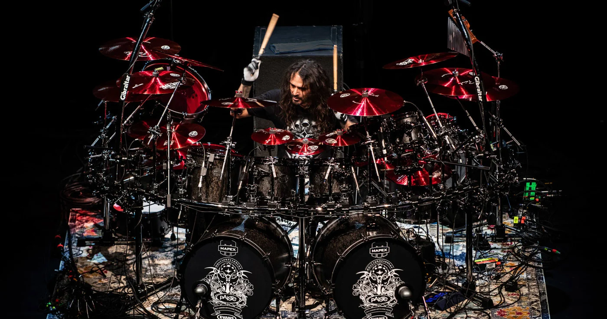

# Tresillo Drun House
### eCommerce desarrollado en forma de aprendizaje en React. 
### Comision 37740
## Utilizacion de:
*Firebase
*Material-Icons
*Css
*Sweet-Alert
### Alumno: Nicolas Dondo

[Visitar projecto](https://spectacular-florentine-8a6b53.netlify.app)

[Visitar el repo](https://github.com/NightHunter04)

[Linkedin](https://www.linkedin.com/in/nicolas-dondo/)

